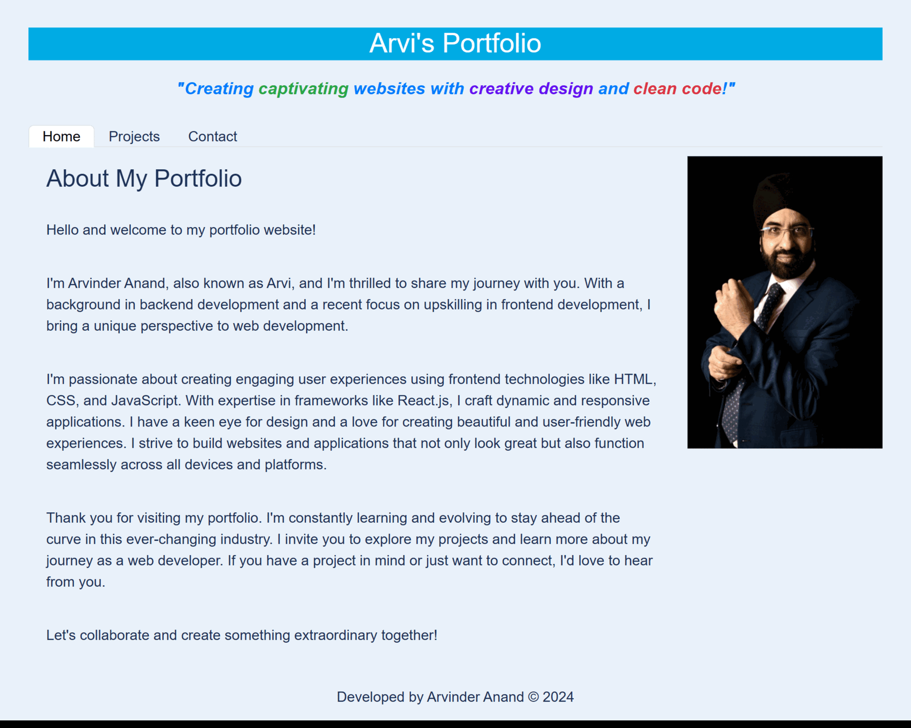
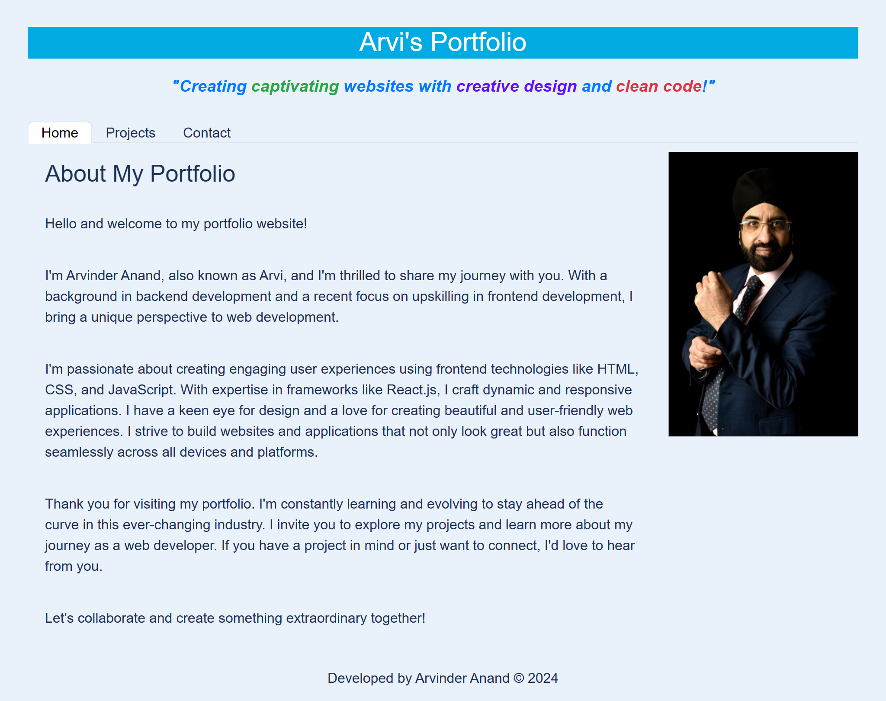
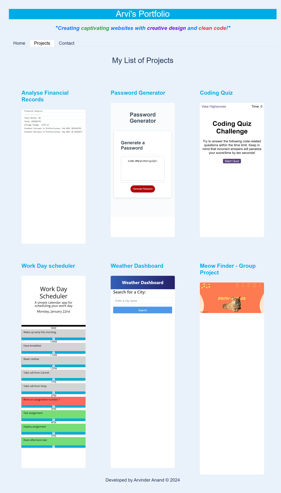
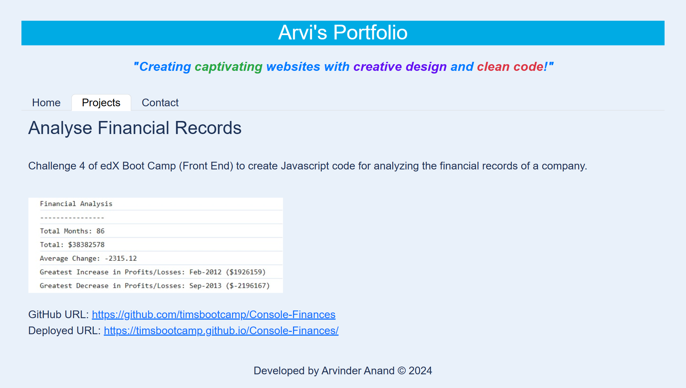
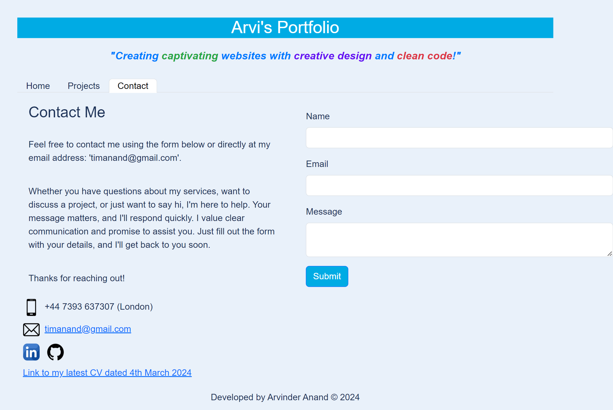

# react-my-portfolio
Challenge 13 of edX Boot Camp (Front End) to build a Portfolio application with React and navigation using React Router, dynamic rendering or another third party router to showcase my skills to potential employers.

> What was my motivation?

My motivation was to accelerate my front end skills in web development so I can successsfully secure a web development job.  I am building on my skills and each week I'm growing from strength to strength and want to achieve top grades throughout all the exercises.

>Why I built this project?

Building the website helped me to bridge the gap between theoretical knowledge and practical of applying
my Javascript, ES6, Node.js and React knowledge that I learnt in Week 13, as well as earlier parts of the course.

> What problem did it solve?

It provides a portfolio of my work presenting a comprehensive collection of my past projects, achievements, and experiences in a structured and visually appealing manner.

> What did I learn?

I learnt about Front End Web Development including React.

> What makes my project stand out? 

It stands out as I have successfully completed the exercise, used good programming practice in terms of writing clean code. I have used appropriate constants and variables that are understandable. There are comments throughout the code so it can be understood by any developer.  

I have pushed myself continually ensuring my work is of the highest quality. The code is readable and maintainable. 

> Technologies Used

* Javascript
* Node.js
* React

> Tools Used

* Microsoft Windows 11
* Visual Studio Code
* Git and GitBash
* Git Lab
* Git Hub
* Slack
* Google Chrome Browser

## Installation

The GitHub repository for my React Portfolio can be found at: 
https://github.com/timsbootcamp/react-my-portfolio

The source code can be cloned from the above link. 

## Usage

Link to my GitHub Repository: https://github.com/timsbootcamp/react-my-portfolio

Link to the Deployed Application : https://timsbootcamp.github.io/react-my-portfolio

Screenshot of Application Favicon

Screenshot of Application - Home Page

Screenshot of Application - Projects Page

Screenshot of Application - Project Page

Screenshot of Application - Contact Page

## Credits

The library for web and native user interfaces:
https://react.dev/

Deploying with Vite:
https://vitejs.dev/guide/static-deploy